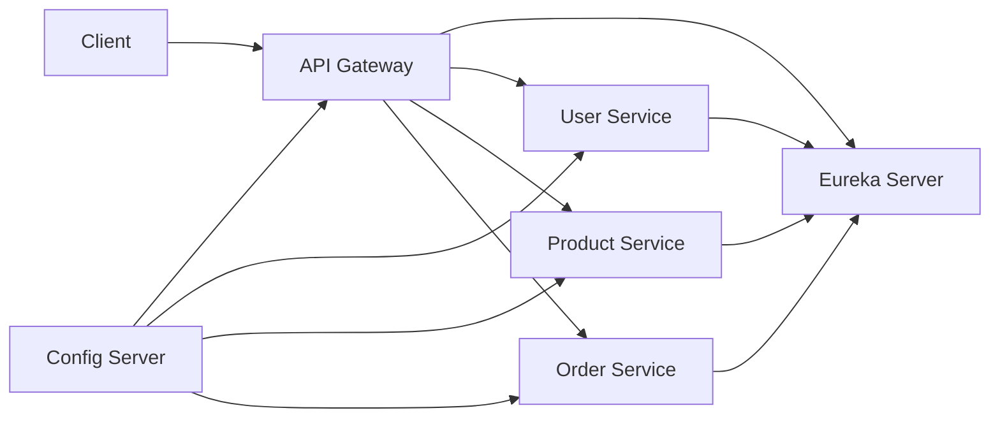

# 🏗️ Ecommerce Platform Infrastructure

## Overview
**Ecommerce-Platform** contains the shared infrastructure and platform-level services that power the ShopSphere microservices ecosystem.

This repository provides centralized configuration, service discovery, and API routing using Spring Cloud components, enabling scalable and maintainable microservices communication.

## Architecture



## Platform Services

### Config Server
Centralized configuration management using Spring Cloud Config.

**Responsibilities**
- Externalized configuration
- Environment-specific properties
- Centralized config management
- Git-backed configuration repository

---

### Eureka Server
Service registry and discovery server.

**Responsibilities**
- Dynamic service registration
- Service discovery
- Health monitoring
- Load-balancing support

---

### API Gateway
Single entry point for all microservices.

**Responsibilities**
- Request routing
- Authentication forwarding
- Centralized API access
- Cross-cutting concerns

---

### Docker Infrastructure
The `microservices-infra` module contains infrastructure setup and Docker Compose configurations.

**Responsibilities**
- Local environment provisioning
- Container orchestration
- Database and dependency setup

## Tech Stack

- Java 21
- Spring Boot
- Spring Cloud Config
- Spring Cloud Gateway
- Netflix Eureka
- Docker
- Docker Compose

## Repository Structure

```text
Ecommerce-Platform
│
├── ConfigServer
├── eureka-server
├── gateway
└── microservices-infra
```

## Getting Started

### Clone Repository

```bash
git clone https://github.com/shital1223/Ecommerce-Platform.git
```

### Start Infrastructure

```bash
docker compose up -d
```

### Start Services

Run the following services in order:

1. Config Server
2. Eureka Server
3. API Gateway
4. Application Microservices

## Service URLs

| Service | URL |
|---|---|
| Eureka Server | http://localhost:8761 |
| Config Server | http://localhost:8888 |
| API Gateway | http://localhost:8080 |

## Design Goals

- Scalable architecture
- Centralized configuration
- Dynamic service discovery
- Loose coupling
- Cloud-ready deployment

## Related Repository

Application microservices repository:

https://github.com/shital1223/Ecommerce-ShopSphere

## Author

Shital Patil
